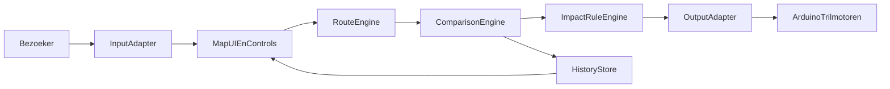

# Uitwerking interactieve maps-installatie (mid-fi + hi-fi)

## 1) Projectdoel
Ontwerp een interactieve, projecteerbare maps-ervaring waarmee bezoekers een begin- en eindlocatie kiezen en 4 vervoersmiddelen vergelijken op maatschappelijke impact:
- Benzine auto
- Elektrische auto
- Trein
- Hyperloop

Vergelijkingscriteria:
- CO2
- Reistijd
- Geluid
- Trillingen
- Afstand

Doelgroep:
- Primair: omwonenden van Veendam
- Secundair: overige bezoekers

## 2) Hardwarekeuze (advies)
### Voorkeur: Kinect One (v2)
- Betere trackingstabiliteit dan Kinect 360
- Geschikter voor tafelprojectie met hand-cursor en dwell-select
- Minder jitter en doorgaans minder frustratie tijdens demo's

### Budgetfallback: Kinect 360
- Bruikbaar voor prototype
- Vereist grotere knoppen, langere dwell (700-900 ms), minder precieze gestures
- Gevoeliger voor licht- en occlusieproblemen

## 3) Mid-fi UX-uitwerking
## 3.1 Kernflow
1. `Home`: kaart van Nederland met CTA "Route vergelijken"
2. `LocatieSelectie`: start en eindpunt plaatsen (kaart + zoekveld)
3. `RouteBerekening`: route zichtbaar in kaart
4. `Vergelijken`: 4 modaliteitskaarten naast elkaar
5. `ImpactDetail`: criteria wisselen (CO2/tijd/geluid/trillingen/afstand)
6. `Geschiedenis`: eerdere routes terugladen en opnieuw vergelijken

## 3.2 Schermindeling voor projectie op tafel
- Midden: grote kaart (`MapCanvas`)
- Links: start/eind invoer + swap + routeknop
- Rechts of onder: 4 vergelijkingskaarten
- Onderaan: geschiedenisbalk met vorige routes

Ontwerpregels:
- Grote targets (minimaal 64-96 px)
- Hoog contrast
- Korte labels, geen lange teksten
- Altijd 1 primaire actie per schermstatus

## 3.3 Interactie zonder touchscreen
- Hand-cursor zichtbaar als duidelijke pointer
- Selectie via dwell (hover 600-900 ms)
- Visuele dwell-ring om accidental clicks te beperken
- Zoom via vaste knoppen (+ / -), niet afhankelijk van complexe pinch-gestures

## 4) Hi-fi UX-uitwerking
## 4.1 Visuele stijl
- Neutrale kaart als basis
- Kleur per modaliteit:
  - Benzine auto: oranje/rood
  - Elektrische auto: groen
  - Trein: blauw
  - Hyperloop: paars
- Iconen per criterium
- Focus op leesbaarheid op afstand

## 4.2 Vergelijkingskaarten (per modaliteit)
Elke kaart bevat:
- Naam + icoon modaliteit
- Reistijd
- Afstand
- CO2-indicator
- Geluid-indicator
- Trillingen-indicator
- "Totale impactscore" (samengestelde score)

Interactie:
- Hover/dwell opent detailniveau
- "Markeer beste optie" per gekozen criterium

## 4.3 Geschiedenis UX
- Lijst met laatste 5-10 routes
- Per item: start-eind, datum/tijd, laatst bekeken criterium
- Herladen met 1 dwell-select

## 5) Multisensorische uitbreiding (haptics)
## 5.1 Waarom haptics
De installatie raakt meerdere zintuigen:
- Zien: kaart + data
- Voelen: trillingen gekoppeld aan impact

## 5.2 Haptics mapping (voorstel)
- Lage impact: korte, zachte pulse
- Middelhoge impact: 2 pulsen, medium intensiteit
- Hoge impact: langere pulse, hogere intensiteit

Per criterium kan een patroon verschillen:
- CO2: langzamere "zwaardere" pulsen
- Geluid: snellere korte tikken
- Trillingen: continue korte trillingen

## 5.3 Eenvoudige technische opzet
- Webapp stuurt events naar lokale bridge (WebSocket/serial gateway)
- Bridge stuurt seriele commando's naar Arduino
- Arduino regelt trilmotoren via PWM

Voorbeeld event:
- `impact:mode=benzine_auto;criterion=co2;level=high`

## 6) Extensibele architectuur (Kinect + Arduino friendly)
## 6.1 InputAdapter
Abstractielaag met events:
- `move(x,y)`
- `hover(targetId)`
- `select(targetId)`
- `zoomIn`
- `zoomOut`
- `pan(dx,dy)`

Mogelijke implementaties:
- `KinectOneAdapter` (primair)
- `Kinect360Adapter` (fallback)
- `MouseAdapter` (ontwikkel/demo fallback)

## 6.2 OutputAdapter
Abstractielaag met feedbackevents:
- `pulseLow`
- `pulseMedium`
- `pulseHigh`
- `patternTrain`
- `patternHyperloop`

Mogelijke implementaties:
- `ArduinoHapticsAdapter`
- `NoopAdapter` (zonder hardware)

## 6.3 Runtime-fallbacks
- Tracking kwijt -> status `trackingLost`, UI toont herstelinstructie
- Haptics offline -> automatisch naar `NoopAdapter`, app blijft werken
- Calibratie mislukt -> herstart calibratieflow

## 7) Kalibratieflow voor projectietafel
1. Toon 4 hoekmarkers op geprojecteerd vlak
2. Laat operator per hoek handpointer plaatsen/selecteren
3. Bereken transformatie naar schermcoordinaten
4. Test met 3 referentieknoppen (links/midden/rechts)
5. Sla calibratieprofiel op

## 8) Data- en interactiestroom

## 9) MVP-implementatiepad (laag budget)
Fase 1 (snel prototype):
- Kaart + route + 4 vergelijkingskaarten
- Muisbesturing
- Dummy impactdata

Fase 2 (interactieve installatie):
- Kinect One inputadapter
- Kalibratiewizard
- Dwell-select

Fase 3 (multisensorisch):
- Arduino bridge
- 1-2 trilmotorzones
- Impact-naar-haptics mapping

Fase 4 (validatie):
- Test met doelgroep Veendam
- Observeer begrijpelijkheid en bedienbaarheid
- Fine-tune thresholds en visuele hi-fi

## 10) Acceptatiecriteria
- Gebruiker kan start/eind kiezen en route tonen op de kaart
- Vergelijking van 4 modaliteiten op 5 criteria werkt consistent
- Geschiedenis kan routes opslaan en terugladen
- Kinect One besturing stabiel na kalibratie
- Kinect 360 fallback blijft functioneel (met ruimer interactieprofiel)
- Haptics kan aan/uit en reageert op impactniveau
- App blijft bruikbaar als sensoren tijdelijk uitvallen

## 11) Wireframe-overzicht per scherm
Uitgangspunt viewport (projectie op tafel):
- Ontwerpcanvas: 1920x1080 (16:9)
- Safe area: 80 px marge rondom
- Interactietargets: minimaal 80x80 px

### Scherm A - Home
Doel:
- Snelle start van routevergelijking

Layout:
- Header (boven): logo/titel links, taalkeuze en instellingen rechts
- Midden: kaart van Nederland (fullscreen dominant)
- Onder midden: primaire knop `Route vergelijken`
- Onderbalk: korte instructie "Beweeg hand naar knop en houd vast om te selecteren"

Elementen:
- `BtnStartVergelijking`
- `MapPreviewNL`
- `BtnTaalNLEN`
- `BtnInstellingen`

Interacties:
- Dwell op `BtnStartVergelijking` -> naar Scherm B

### Scherm B - LocatieSelectie
Doel:
- Begin- en eindlocatie kiezen

Layout:
- Linkerpaneel (30%): invoer en acties
- Midden/rechts (70%): grote interactieve kaart
- Onder kaart: route-acties

Elementen:
- `InputStartLocatie`
- `InputEindLocatie`
- `BtnSwapLocaties`
- `BtnGebruikCursorPlaatsing`
- `MapCanvasSelect`
- `BtnBerekenRoute` (primair)
- `BtnReset`

Interacties:
- Selecteer invoerveld -> virtueel toetsenbord of lijstsuggesties
- Dwell op kaart -> marker plaatsen
- Dwell op `BtnBerekenRoute` -> naar Scherm C

### Scherm C - Vergelijking
Doel:
- 4 vervoersmiddelen direct vergelijken op impact

Layout:
- Links (25%): route-informatie + criteriafilter
- Midden (50%): kaart met route overlay
- Rechts (25%): 4 modaliteitskaarten in 2x2 raster
- Onderaan: geschiedenis-strip

Elementen links:
- `RouteSummary` (start/eind, afstand totaal)
- `CriterionChips` (`CO2`, `Reistijd`, `Geluid`, `Trillingen`, `Afstand`)
- `BtnNieuweRoute`

Elementen midden:
- `MapCanvasRoute`
- `BtnZoomIn`
- `BtnZoomOut`
- `LegendModaliteiten`

Elementen rechts:
- `CardBenzineAuto`
- `CardElektrischeAuto`
- `CardTrein`
- `CardHyperloop`
- Elke kaart: tijd, afstand, impactscore + mini-indicatoren

Elementen onder:
- `HistoryQuickBar` (laatste 5 routes)

Interacties:
- Dwell op criteriumchip -> alle kaarten herordenen op gekozen criterium
- Dwell op modaliteitskaart -> naar Scherm D (detail)
- Dwell op history-item -> route herladen

### Scherm D - ImpactDetail
Doel:
- Verdieping per modaliteit en criterium

Layout:
- Boven: geselecteerde modaliteit + terugknop
- Links: criteria met waarden
- Midden: route en context op kaart
- Rechts: haptics-preview en maatschappelijke toelichting

Elementen:
- `BtnTerugVergelijking`
- `DetailMetricList`
- `MapCanvasFocusedRoute`
- `ImpactNarrativePanel`
- `BtnHapticsTestPulse`
- `ToggleHapticsAanUit`

Interacties:
- Dwell op `BtnHapticsTestPulse` -> lokale trilmotor-test
- Dwell op `ToggleHapticsAanUit` -> feedback in/uitschakelen

### Scherm E - Geschiedenis
Doel:
- Eerdere vergelijkingen terugkijken/hergebruiken

Layout:
- Linkerzijde: filteropties (datum, afstandsklasse, modaliteit)
- Rechterzijde: routekaartenlijst

Elementen:
- `FilterDatum`
- `FilterAfstand`
- `FilterModaliteit`
- `HistoryRouteCards`
- `BtnOpenInVergelijking`
- `BtnVerwijderItem`

Interacties:
- Dwell op routekaart -> selectie actief
- Dwell op `BtnOpenInVergelijking` -> terug naar Scherm C met geladen data

### Scherm F - Kalibratie (operator-only)
Doel:
- Kinect-coordinaten uitlijnen op geprojecteerd tafelvlak

Layout:
- Volledig scherm met wizard stappen
- Stapindicator bovenin

Elementen:
- `Step1Intro`
- `Step2CornerTopLeft`
- `Step3CornerTopRight`
- `Step4CornerBottomRight`
- `Step5CornerBottomLeft`
- `Step6ValidationTargets`
- `BtnOpslaanCalibratie`
- `BtnOpnieuw`

Interacties:
- Operator wijst elke hoek aan en houdt dwell vast
- Validatiescherm toont 3 testknoppen
- Bij voldoende precisie: profiel opslaan

## 12) Wireframe interactieregels (globaal)
- Dwell default: 700 ms (Kinect One), 850 ms (Kinect 360 fallback)
- Hover feedback:
  - 0-300 ms: subtiele highlight
  - 300-700+ ms: progress ring
  - Na threshold: select + korte visuele pulse
- Cooldown na selectie: 250 ms om dubbeltrigger te voorkomen
- Alleen 1 actieve pointer tegelijk

## 13) Componenten per scherm (implementatiecheck)
- Home: `MapPreviewNL`, `PrimaryCTA`
- LocatieSelectie: `LocationInput`, `VirtualKeyboard`, `MapCanvasSelect`
- Vergelijking: `MapCanvasRoute`, `ComparisonGrid`, `CriterionChips`, `HistoryQuickBar`
- ImpactDetail: `MetricBreakdown`, `ImpactNarrativePanel`, `HapticsControl`
- Geschiedenis: `HistoryFilters`, `HistoryList`
- Kalibratie: `CalibrationWizard`, `CalibrationStore`
